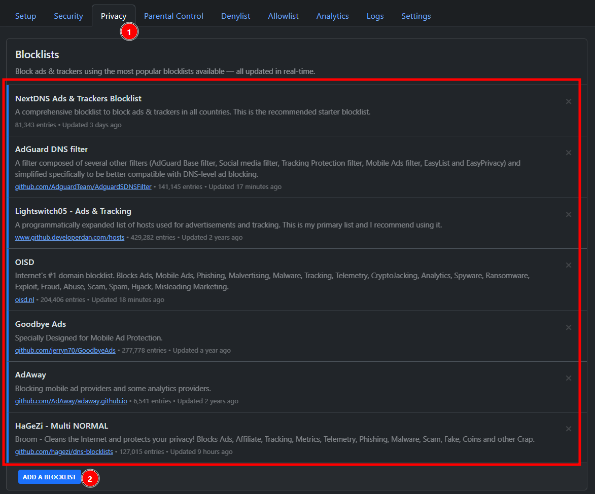
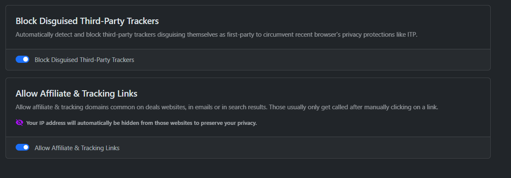
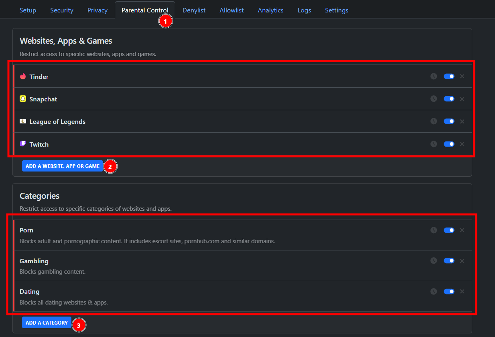
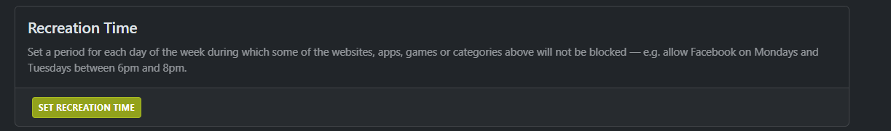
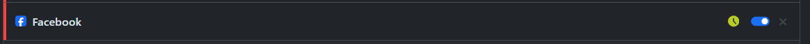
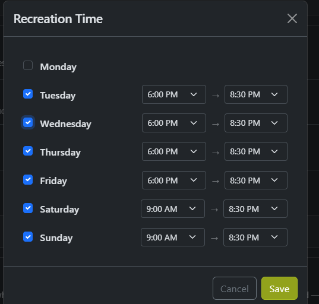
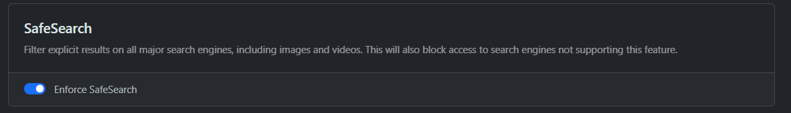
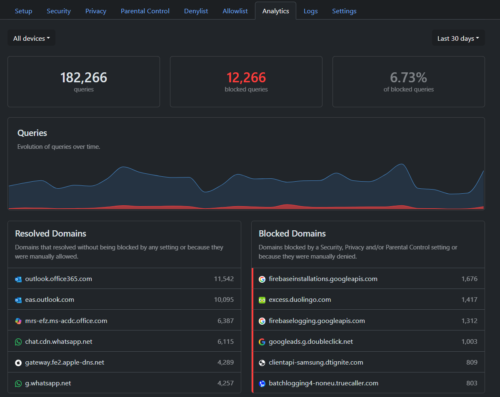
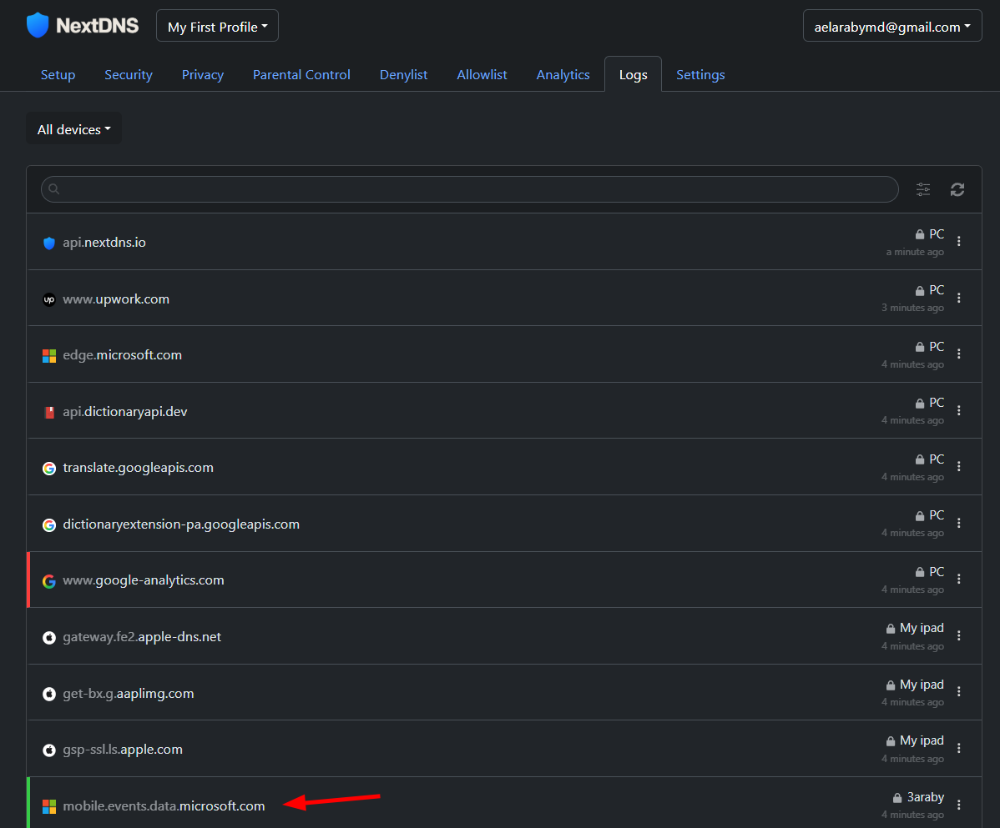
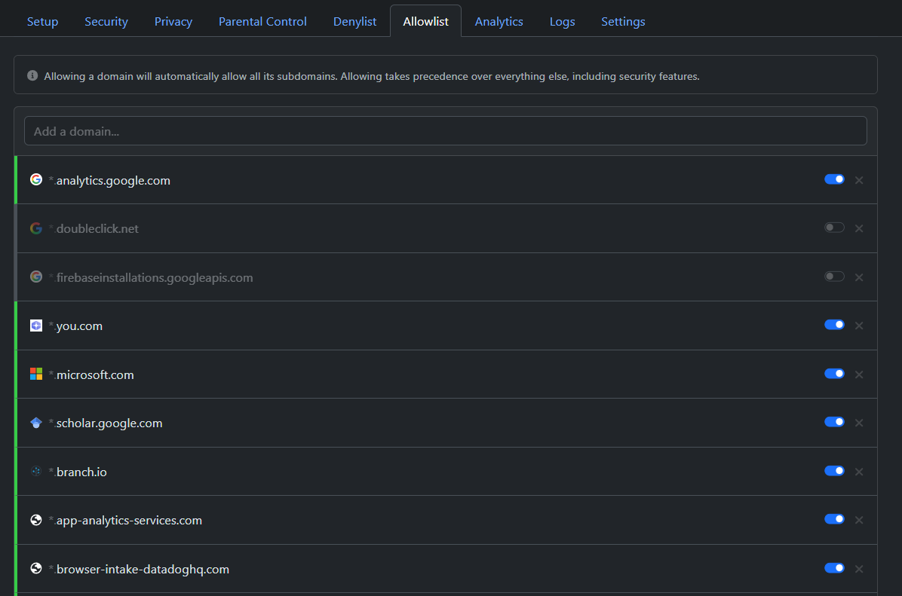

## مقدمة

ازدادت الإعلانات المزعجة والمتتبّعات وبرامج الاحتيال والمحتوى غير الملائم حضورًا في تصفّحنا اليومي، إلى درجة تُربك التجربة، وتعرّض خصوصيتنا وأجهزتنا لمخاطر حقيقية. الحلول التقليدية مثل إضافات حجب الإعلانات تعمل داخل متصفّح بعينه مازالت غير ملائمه للمحتوى في التطبيقات للهاتف. هنا تبرز فكرة الفلترة على مستوى الـDNS كطبقة حماية تعمل قبل وصول الاتصال أصلًا إلى الموقع أو التطبيق (Filter)، فتمنع كثيرًا من المصادر المزعجة والضارة من البداية.

ضمن هذا النهج يأتي NextDNS: خدمة DNS مُشفّرة مجانية تجمع بين الأمان والخصوصية والتحكّم الأبوي في لوحة واحدة سهلة. تستطيع عبرها حجب الإعلانات والمتتبّعات، إيقاف نطاقات البرمجيات الخبيثة، تفعيل SafeSearch ووضع المقيّد في يوتيوب، وحتى وضع قواعد مخصّصة للحجب أو السماح، مع تقارير تساعدك على فهم ما يحدث على شبكتك دون تعقيد.

هذا المقال يأخذك من الصورة الكبيرة إلى التطبيق العملي خطوة بخطوة. سنبدأ بتبسيط فكرة DNS ولماذا تصلح للفلترة، ثم ننتقل إلى إعداد NextDNS على مختلف الأجهزة (Android، iOS، Windows/macOS، والراوتر).

## ما هو نظام DNS ببساطة

في كل مرة تكتب اسم موقع مثل `google.com`، لا يفهم المتصفح ما هو هذا الاسم بالظبط؛ ما يفهمه هو عناوين رقمية تُسمّى IP. 
هنا يأتي دور نظام DNS بوصفه “مترجم” حيث يحوِّل اسم الموقع إلى عنوان الـ IP الصحيح.

علي سبيل المثال للدخول علي موقع جوجل يمكنك كتابة `142.250.191.238` أو `google.com`. من يقوم بتحويل النص الانجليزي للـ IP الخاص بالموقع هو نظام ال DNS . من دون هذه الترجمة اللحظية، ستصبح زيارة أي موقع عملية صعبه وكان علينا حفظ الأرقام بدل من النصوص للمواقع التي نريد زيارتها.

ومع تطوّر الاستخدام، لم يعد DNS مجرّد “دفتر تليفونات للإنترنت 😁” فحسب؛ صار أيضًا نقطة يمكن عبرها تحسين الخصوصية والأمن وحجب المحتوى غير المرغوب فيه خاصة عند استخدام DNS مُشفَّر أو خدمات ذكية تضيف طبقات فلترة وحماية. 

## من أين نبدأ؟

إذا أردنا فلترة الإعلانات والمحتوى الضار عبر الـDNS بأقل تعقيد، فأمامنا عدة مسارات. أبسطها الاعتماد على مزوّدات عامة بفلترة جاهزة مثل Cloudflare Family وQuad9 وOpenDNS FamilyShield وCleanBrowsing وAdGuard DNS؛ هذه تُفعَّل فورًا وتمنحك سرعة واعتمادية، لكنّ قدرتها على التخصيص تبقى محدودة.

في هذا المقال سنتحدث عن NextDNS لأنّه يجمع سهولة التشغيل مع التخصيص الدقيق؛ ويتضمن تحكّمًا أبويًا جاهزًا مثل SafeSearch والوضع المقيّد ليوتيوب، ويمنحك سجلات قابلة للإيقاف. الأهم أنّ إعدادًا واحدًا يمكن أن يخدم أجهزة متعددة.

## الشرح العملي والتنفيذ خطوة بخطوة

### إنشاء الحساب والتثبيت علي الأجهزة

![[Pasted_image_20251020010845.png]](/Pasted_image_20251020010845.png)
قم بالدخول علي https://nextdns.io  وإنشاء حساب خاص بك.

![[Pasted_image_20251020031344.png]](/Pasted_image_20251020031344.png)
الان لإضافة ال DNS للأجهزه لدينا طريقتين
#### 1. سهله وسريعه

وهي إضافته علي الأجهزة مباشرة 

##### 1. لـ Android
 قم بالدخول علي الاعدادات (Settings) وقم بالبحث عن إعدادات الـ DNS كما في الصورة
  
   ![[Pasted_image_20251020032557.png]](/Pasted_image_20251020032557.png)

 ![[Pasted_image_20251020032855.png]](/Pasted_image_20251020032855.png)
قم بنسخ الـ DNS-over-TLS/QUIC الموجود في حسابك علي NextDNS
   ![[Pasted_image_20251020033029.png]](/Pasted_image_20251020033029.png)
##### 2. لمتصفحات الـ PC/Mac

قم بنسخ DNS-over-HTTPS من الـ NextDNS

![[Pasted_image_20251020033611.png]](/Pasted_image_20251020033611.png)

##### 3. لباقي الاجهزه Ios, chomeOS, Linux
يمكنك اتباع الطريقه التفصيليه في ال setup guide الموضح لكل جهاز في الموقع
![[Pasted_image_20251020034055.png]](/Pasted_image_20251020034055.png)

#### 2. أكثر شموليه

وهو اضافة ال DNS filter علي مستوي الراوتر، وهو ما يعتبر الطريقه الأمثل والأفضل. لكن تحتاج العديد من الخطوات المعقده التى قد نحتاج مقاله مفضله أخري في وقت لاحق إذا ما كانت مطلوبه.

### خصائص التحكم 
بعد تنصيب الـ DNS علي الجهاز تظهر ال Home كما هو موضح

ننتقل الي كيفية تخصيص ال DNS Filter الخاص بك تفصيلياً وكيفية منع الإعلانات وغيره

ويمكنك تخصيص وقت محدد لتفعيل بعد المواقع في وقت معين عن طريق اضافة Recreation Time

ثم قم بتفعيل ال Safe search
يقوم باستبعاد المحتوي الضار والاباحي من البحث في المتصفح مباشرة وهو من أفضل مميزات الموقع، ان كان لديك شبكه وايفاي عامه في شركة أو مكتب ويستخدمها العديد من الزوار

قمنا الان بالإعدادات الأساسية
في قائمة الاحصائيات (Analytics)
ستجد ملخص سريع 

مع الملاحظة أن الحساب المجاني الواحد له 3000,000 queries شهرياً.
وهو من خبرتي تكفي مستخدم عادي استخدام متوسط. في حالة أنها لم تكفي يمكنك إما الاشتراك في الخدمة المدفوعه ب مبلغ 2$ شهرياً فقط، أو عمل حساب مجاني لكل مجموعة أجهزه مع بعضها.

## ملحوظه هامه عليك الانتباه لها
القوائم التي قمنا بإضافتها هي خاصه بمنع التتبع والاعلانات وغيرها، قد تجد في بعض الاحتمالات النادرة توقف لبعض الخدمات او أخطاء اثناء التصفح 
يمكنك في هذه الحاله أولا أن تدخل علي الـ Logs الخاصة بك 

وتحدد الـ quieryالخاص بالخدمه التى توقفت عندك
ثم إضافتها في خاصنة الـ (Allowlist)

ولكن عليك ان تتأكد من الخدمه انها ليست مصدر إعلانات أو تتبع.

## خاتمة

ليس التخلص من الإعلانات رفاهية، بل استرداد للهدوء والخصوصية. يحوّل NextDNS الـDNS من مجرد “مترجم” إلى درعٍ خفيف وسهل.
ابدأ بهذه الإعدادات البسيطه، فعِّل الأمان والخصوصية وSafeSearch، اربط أجهزتك بحساب واحد، ثم راقب يومين وأضف ما يلزم إلى قائمة السماح (Allowlist). بهذه الخطوات القليلة ستنتقل من تصفّح مُثقل بالضجيج إلى شبكةٍ أنظف وأهدأ وأأمن بلا تعقيد ولا تكلفة تُذكر.