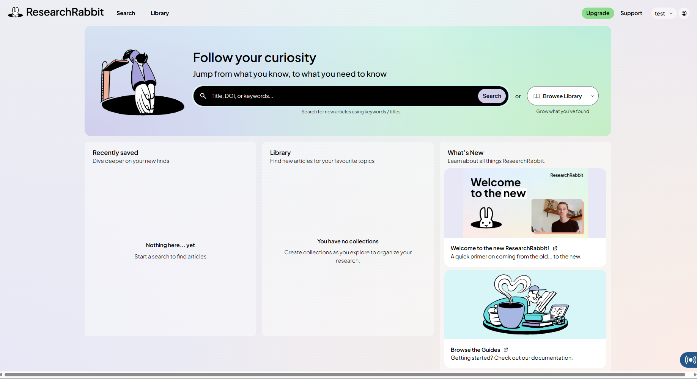
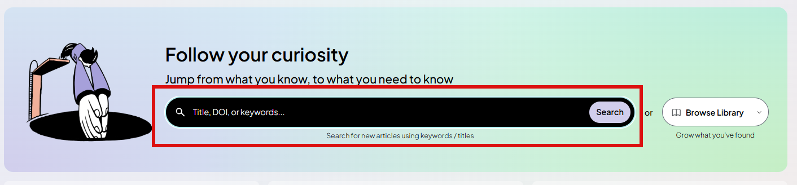
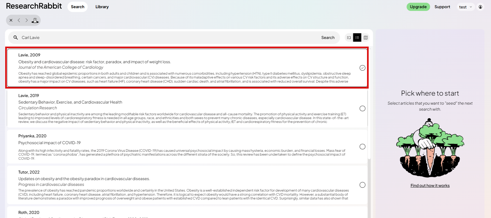
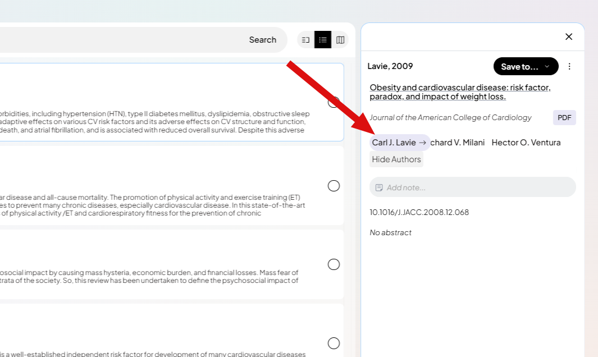
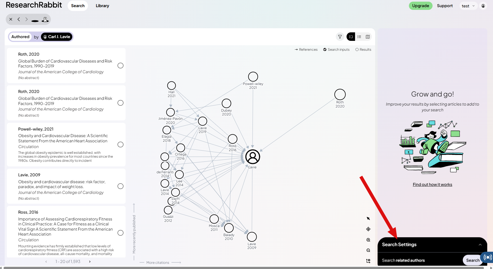
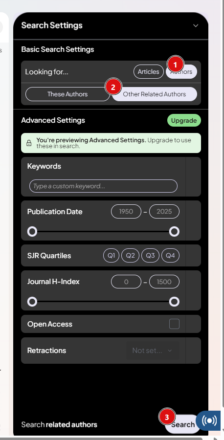
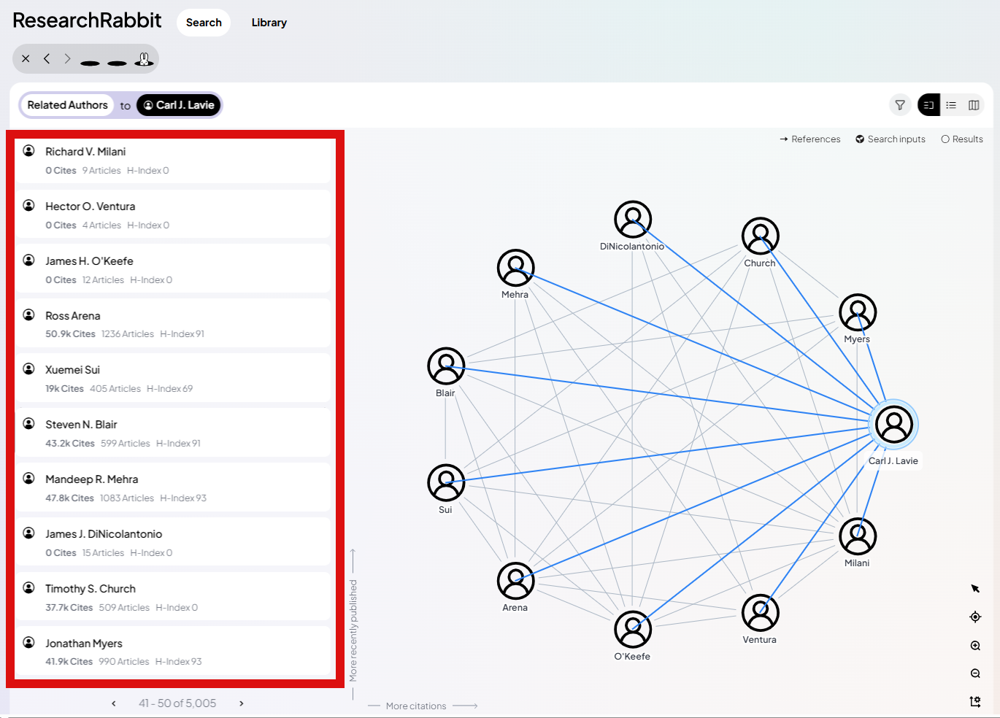

Most early-career physicians waste months emailing random senior names without confirming whether it fit your needs or not For rotations/electives, use official pathways when required; email should clarify the correct process, not bypass it.

## ✅ Step-by-step: “Mentor mapping”

### ✅ Step 1: Build a shortlist of target doctors 
Pick **10–25 pioneer clinicians or program directors** in your specialty niche.

Where to find names (choose 2–3 sources):
- 📌 Program faculty pages (your target institutions)
- 📌 Recent conference speaker lists in your niche
- 📌 Last-author/senior-author names from guidelines/review articles 
- 📌 “Where do trainees like me actually rotate/work?” (ask senior residents/fellows)

### ✅ Step 2: Search the research rabbit wth the author name and use the map views to reveal *the doctor network*
Your goal is not “more papers.” Your goal is:
- 📌 Who collaborates with whom?
- 📌 Which clinicians repeatedly appear in the same cluster?

Use these views strategically:
- ✅ **Network view**: identifies clusters and connected authors
- ✅ **Timeline view**: shows whether this group is currently active vs historically important

after opening https://app.researchrabbit.ai/

Search with title of article of the author you want to check its network 

say we want to map the connections of [Dr Carl J Lavie](https://scholar.google.com/citations?view_op=list_works&hl=en&hl=en&user=apPtA7MAAAAJ) 
choose any artcile he authored 

Cick on his name 

apply the filters to see the authors view 

Now You can see the list of the connections to the target doctor

### ✅ Step 3: Identify 3 tiers of “contact targets” (this is where opportunity usually lives)

Think in tiers:

- 📌 **Tier A (Visible leaders):** famous senior names  

- ✅ **Tier B (Active builders):** mid-career clinician-scientists leading projects  
  Often the best mentorship.

- ✅ **Tier C (Gateway collaborators):** frequent co-authors, junior faculty, senior fellows, lab managers  
  Often the fastest path to joining a project or getting rotation guidance.

### ✅ Step 4: Reality-check outside ResearchRabbit (avoid false targets)
Before emailing anyone:
- 📌 Confirm role + contact info on the institution site
- 📌 Confirm they actually mentor trainees (lab page, trainees listed, recent projects)